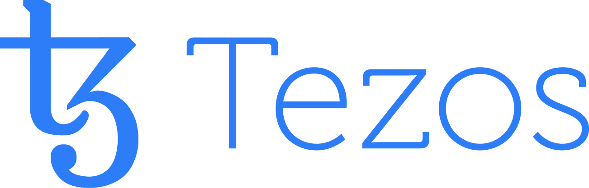

<h1 align="center">Tezos Developers Day 2020</h1>

  Paris, Maison de la Mutualité 
  March 6, 2020 
  
  &nbsp;&nbsp;&nbsp;&nbsp;&nbsp;&nbsp;&nbsp;&nbsp;&nbsp;&nbsp;
  

### What

This Tezos Developers Day aims to gather developers from the blockchain space during one day in Paris, around tutorial presentations and discussions.

This is an open event and attendance is free (although registration is mandatory -- see below). Developers are of course welcome.

### Where and when

One day after the [EthCC Community Conference](https://ethcc.io/), this Tezos Dev Day will be held at [Maison de la Mutualité](https://www.maisondelamutualite.com/en) ([24, rue Saint-Victor, 75005 Paris](https://www.google.com/maps/place/Maison+de+la+Mutualit%C3%A9/@48.848713,2.350635,15z/data=!4m5!3m4!1s0x0:0x2a595de9d6bf634b!8m2!3d48.848713!4d2.350635)), in the heart of Paris.

### Registration

The [registration page is here](https://forms.gle/BV6Xft31sNy36t9Z7).

### Preliminary program

There will be coffee breaks, but participants will be on their own for lunch (there are plenty of restaurants around).

The program will be refined in the next days, and an email message will be sent with the final version of the program.

* 09:00 - _Welcome_
* 09:00 - **Tezos _vs._ Ethereum**, Adrian Brink (Cryptium Labs)
* 09:45 - **LIGO**, Christian Rinderknecht and Rémi Lesénéchal (LIGO)
* 10:30 - _Coffee Break_
* 11:00 - **SmartPy**, Roland Zumkeller
* 11:45 - **Migrating from Solidity to LIGO for a greater good**, Julian Konchunas, Anastasiia Kondaurova and Sergii Glushkovskyi (Madfish Solutions)
* 12:30 - _Lunch Break_
* 14:00 - **Implementing a partial token contract on Tezos with TZIP-12** Matej Sima (Stove Labs)
* 14:45 - **Dexter: a Decentralized Exchange for Tezos by camlCase**, James Haver (camlCase)
* 15:30 - _Coffee Break_
* 16:00 - **Building a simple dApp**, Alexandre Doussot (Nomadic Labs)
* 16:45 - **Truffle and Tezos**, Cruz Molina (Truffle)
* 17:00 - _Closing_

### Register, participate, discover how to develop on Tezos, and meet other developers!
